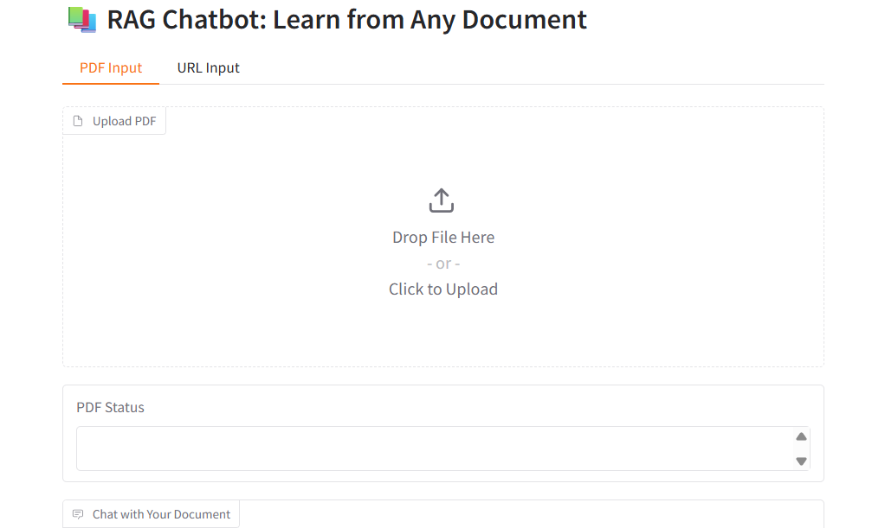

# 🤖 Chatbot RAG : Learn from Any Document

> **Auteur :** Mohamed Lamine OULD BOUYA  
> **Projet IA & Gradio — 2025**

Chatbot intelligent basé sur la **RAG (Retrieval-Augmented Generation)** permettant d’interroger des **documents PDF** ou des **sites Web** et d’obtenir des réponses contextuelles grâce à **OpenAI GPT-3.5-Turbo**.

---

## ✨ Objectif du projet

Ce projet démontre la création d’un **assistant intelligent** capable de :
- Extraire du texte à partir de fichiers PDF 📄 ou de pages Web 🌐  
- Générer des **embeddings** vectoriels pour comprendre le contexte  
- Répondre à des questions en utilisant **GPT-3.5-Turbo**  
- Fournir une **interface utilisateur interactive** avec **Gradio**

---

## ⚙️ Installation et configuration

### 1️⃣ Cloner le projet

```bash
git clone https://github.com/<ton_utilisateur>/chatbot-rag-ia-gen.git
cd chatbot-rag-ia-gen
```

---

### 2️⃣ Créer et activer un environnement virtuel

```bash
python -m venv .venv
.\.venv\Scripts\activate   # sous Windows
# ou
source .venv/bin/activate  # sous Linux/Mac
```

---

### 3️⃣ Installer les dépendances

#### 📦 Dépendances principales :
```bash
pip install -r requirements.txt
```

#### 🧑‍💻 Dépendances de développement (optionnel) :
```bash
pip install -r requirements-dev.txt
```

---

### 4️⃣ Configurer la clé OpenAI

Crée un fichier `.env` à la racine du projet avec ta clé API :

```bash
OPENAI_API_KEY=ta_cle_openai
```

---

## 🧠 Fonctionnement du chatbot

1. L’utilisateur charge un **PDF** ou saisit une **URL**.  
2. Le texte est **extrait et découpé en morceaux** (“chunks”).  
3. Ces morceaux sont **convertis en embeddings** vectoriels.  
4. Lorsqu’une question est posée, le chatbot :
   - Cherche la portion la plus pertinente du texte.
   - Envoie le contexte à OpenAI GPT-3.5-Turbo pour formuler une réponse.

---

## 🚀 Lancer l’application Gradio

```bash
python app_gradio.py
```

L’application s’ouvrira automatiquement dans ton navigateur :

- **Local URL :** http://127.0.0.1:7860  
- **Public URL (Gradio Live) :** fournie dans le terminal

---

## 🖥️ Aperçu de l’interface

Voici un aperçu de l’interface Gradio en fonctionnement 👇



> 💡 L’application offre deux modes d’entrée :  
> - **PDF Input** : importer un document  
> - **URL Input** : extraire du contenu depuis un site web  

---

## 📂 Structure du projet

```text
chatbot-rag-ia-gen/
├── .env.example              ← exemple de configuration (.env à créer)
├── .gitignore                ← fichiers exclus de Git
├── .venv/                    ← environnement virtuel local
│
├── assets/                   ← ressources (captures, images, etc.)
│   └── demo_interface.png    ← aperçu de l’interface Gradio
│
├── app_gradio.py             ← application web Gradio (interface utilisateur)
├── Chatbot_RAG.ipynb         ← notebook explicatif (RAG et tests)
├── README.md                 ← documentation du projet
│
├── requirements.txt          ← dépendances “runtime” (exécution)
├── requirements-dev.txt      ← dépendances “dev” (VS Code / Jupyter)
└── .env                      ← clé API OpenAI (non versionnée)
```

---

## 🧩 Différence entre les deux fichiers `requirements`

| Fichier | Usage | Description |
|----------|--------|-------------|
| `requirements.txt` | **Runtime** | Dépendances nécessaires pour exécuter le chatbot et l’interface Gradio. |
| `requirements-dev.txt` | **Développement** | Dépendances supplémentaires pour le travail dans VS Code ou Jupyter Notebook (black, pytest, jupyter…). |

---

## 🧪 Technologies utilisées

| Catégorie | Librairies / outils |
|------------|----------------------|
| **Langage principal** | Python 3.12 |
| **IA & Embeddings** | OpenAI API (text-embedding-ada-002, GPT-3.5-Turbo) |
| **Interface utilisateur** | Gradio |
| **Traitement du texte** | BeautifulSoup4, PyPDF2, Requests, Numpy |
| **Configuration** | python-dotenv |
| **Outils Dev** | Jupyter, Black, iSort, Pytest |

---

## 📜 Licence

Ce projet est open source et libre d’utilisation à des fins pédagogiques et personnelles.  
📄 Licence MIT

---

## 👨‍💻 Auteur

**Mohamed Lamine OULD BOUYA**  
📧 Contact : [ouldbouya.mohamedlamine@gmail.com]  
🌐 GitHub : [https://github.com/Momo3972](https://github.com/Momo3972)

---

> 💬 *Ce projet illustre une implémentation complète de la RAG (Retrieval-Augmented Generation) avec Python et Gradio, idéale pour la recherche, la documentation intelligente et les assistants personnalisés.*

